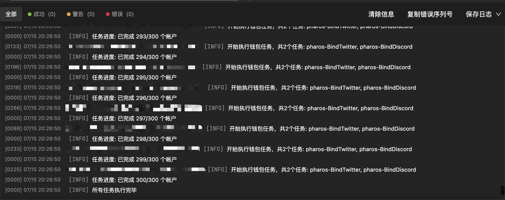
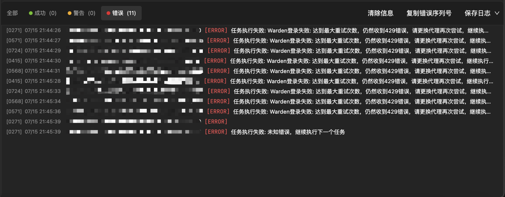
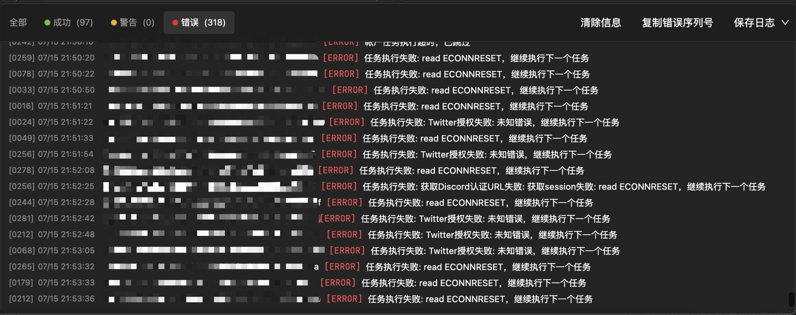
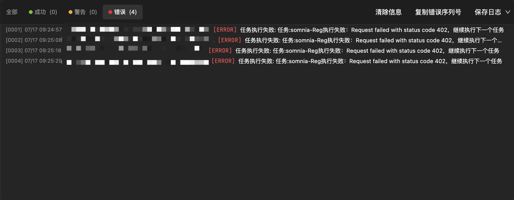

# ❓ 常见问题

[← 返回主页](../README.md)

本页面收集了FarmMaster使用过程中的常见问题和解决方案。

## 🔴 脚本运行错误

### 1. 任务执行失败
**问题描述**：执行任务没有执行完成&失败的通知

**解决方案**：
- 检查私钥是否正确填写（前后无空格）
- 检查是否没有导入代理，但却选择了使用代理
- 确认钱包配置文件格式正确

### 2. 429 错误
**问题描述**：执行任务显示 429 错误

**解决方案**：
- 项目方接口具有IP防护能力
- 尝试更换其他代理IP
- 如更换代理IP后仍有错误，联系技术客服

### 3. 网络连接错误
**问题描述**：显示 read ECONNRESET、socket hang up错误

**解决方案**：
- 检查VPN软件是否开启全局并进行测速
- 选择"不使用代理"进行再次尝试
- 确保本地网络连接稳定

### 4. 代理相关错误
**问题描述**：请求显示 402、407 错误

**解决方案**：
- 代理IP已经到期
- 前往代理网站进行检查和续费

## 🔧 程序安装和更新

### Q：更新后仍反复提示更新？
**A：** 更新失败，一般是网络问题，尝试重新下载

### Q：更新导致黑屏怎么解决？
**A：** 联系 @孤风 并说明系统和电脑版本

## 🎯 功能使用问题

### Q：银河账号连接失败？
**A：**
- 检查账号登录状态
- 确保网络连接稳定
- 验证账号绑定信息

### Q：任务无法自动完成？
**A：**
- 检查任务链接是否正确
- 确认任务类型是否支持
- 查看任务执行日志

### Q：奖励领取失败？
**A：**
- 检查钱包绑定状态
- 确保满足领取条件
- 验证账号权限

## 🔧 技术支持

如果以上解决方案无法解决您的问题，请联系对应的技术支持：

- **项目交互问题**：@1号技师全心全意为您服务
- **银河/指纹浏览器问题**：@2号牛马在线解答
- **安装/更新/黑屏问题**：@孤风

## 📝 问题反馈

如果您遇到新的问题，请提供以下信息：

1. 错误截图
2. 操作步骤
3. 系统环境
4. 错误日志

这将帮助我们更快地定位和解决问题。