# 代理IP选购配置

[← 返回安装教程](README.md) | [← 返回主页](../README.md)

## 1. 什么是代理？

代理（Proxy）是一种网络中介服务，允许您的请求通过代理服务器转发到目标网站，从而隐藏真实IP地址，实现匿名访问、突破访问限制等目的。

一般情况下我们使用代理的作用主要有:

1. 突破水龙头领水的IP限制。
2. 隐藏真实IP地址，让项目方无法确认我们的身份。
3. 为 Twitter/Discord 等帐户提供稳定的网络环境，延长帐户使用寿命。

---

## 2. 代理的样式

目前仅支持以下格式的代理：

- 基本格式：`IP:端口:用户名:密码`
- 带协议格式：`IP:端口:用户名:密码:协议类型`
- **域名格式**：`域名:端口:用户名:密码` 或 `域名:端口:用户名:密码:协议类型`

其中：
- IP：代理服务器的IP地址（如 192.168.1.1）或域名（如 proxy.example.com）
- 端口：代理服务器的端口号（如 8080）
- 用户名/密码：部分代理需要身份认证
- 协议类型（可选）：支持 `http`、`socks`、`socks5`，不填写时默认为 `http`

**示例：**

| 代理类型 | 格式示例 | 说明 |
|---------|---------|------|
| 基本HTTP | `123.45.67.89:8080:user:pass` | 默认HTTP协议 |
| 指定HTTP | `123.45.67.89:8080:user:pass:http` | 明确指定HTTP |
| SOCKS5 | `123.45.67.89:1080:user:pass:socks5` | 高匿名代理 |
| 域名格式 | `proxy.example.com:8080:user:pass` | 支持域名 |
| 域名+协议 | `proxy.example.com:8080:user:pass:http` | 域名指定协议 |

---

## 3. 如何选购代理

- **选择正规代理服务商**：优先选择有口碑、售后服务好的代理商，避免免费代理（不稳定且易泄露隐私）。

- **根据需求选择类型**：
  - **普通网页访问**：推荐 HTTP 代理。
  - **高匿名性或特殊协议需求**：推荐 SOCKS5 代理。
  - **静态IP代理**：IP地址固定不变，购买后将长时间属于您。适用于需要长期稳定、保持同一IP的场景，例如：
    - **社交媒体账号管理**：如 Twitter、Discord 账号的日常登录和操作，避免因IP频繁变动触发安全验证或封禁。
    - **特定网站或服务访问**：某些网站会记录IP进行权限管理，静态IP有助于维持访问权限。
    它的优点是稳定性高，但成本通常也相对较高。
    
  - **动态IP代理**：IP地址会周期性自动变化，或者在每次连接时分配一个新的IP地址。适用于需要频繁更换IP以规避网站限制的场景，例如：
    - **水龙头领取测试币**：许多测试网水龙头对IP领取频率有限制，动态IP可以帮助规避这些限制。
    - **大规模数据抓取/爬虫**：通过不断更换IP，有效避免被目标网站识别和封锁，提高数据获取效率。
    - **批量注册/投票**：在需要创建大量账号或进行批量操作时，动态IP能模拟不同用户的访问，降低被识别的风险。
    动态IP的优势在于灵活性和反侦测能力强，但可能不如静态IP稳定。

- **关注带宽和并发**：根据任务量选择带宽和并发数合适的套餐。
- **测试稳定性**：购买前可要求代理商提供测试，确保代理可用率高。
- **注意事项：首次购买先买少量进行测试，测试稳定后再进行购买。**

- **安全提醒**：
  - 不要在不信任的网络环境下使用付费代理
  - 定期更换代理密码，避免账号被盗用
  - 避免在代理上进行涉及敏感信息的操作
  - 选择信誉良好的代理服务商，避免数据泄露风险

### 下面是我们正在使用的代理：

- Webshare: [官方网站](https://www.webshare.io/?referral_code=lnui3v852b41) (静态IP，养Twitter、Discord 账号等操作时使用)
- 海外代理: [官方网站](https://www.haiwaidaili.net/register?Invitation_code=12333) (动态IP，领水时使用)

#### Webshare 购买教程 (静态IP)

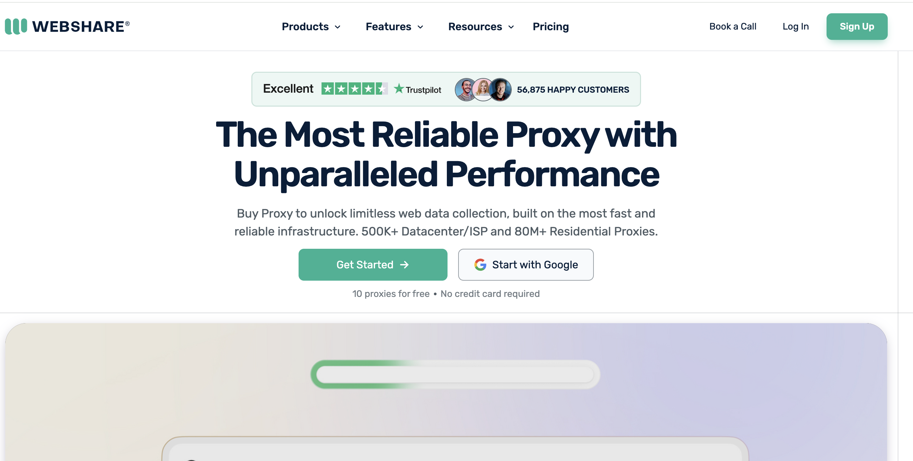

*Webshare 官方网站首页*

1.  **访问官网并注册**：
    - 打开 Webshare 官方网站：[https://www.webshare.io](https://www.webshare.io/?referral_code=lnui3v852b41)
    - 点击注册按钮，填写邮箱、密码等信息完成账号注册（可使用Google帐户直接登录）。
    
    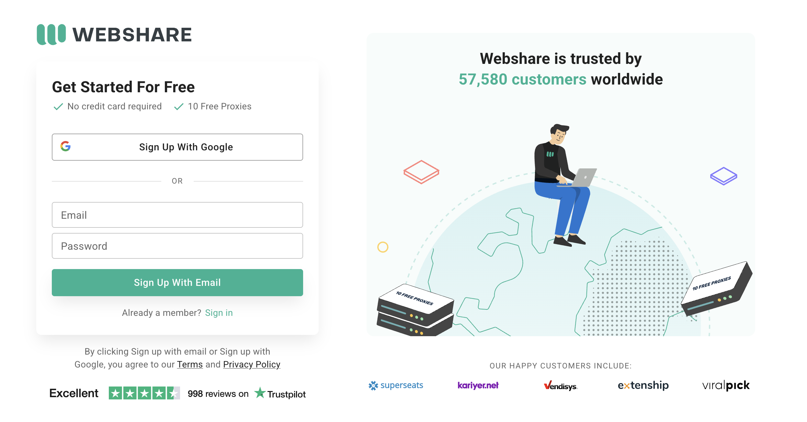

    *Webshare 注册页面*
2.  **选择套餐并购买**：
    - 登录后，点击左侧的Proxy Server按钮，选购合适数量的代理并根据提示完成支付。
    
    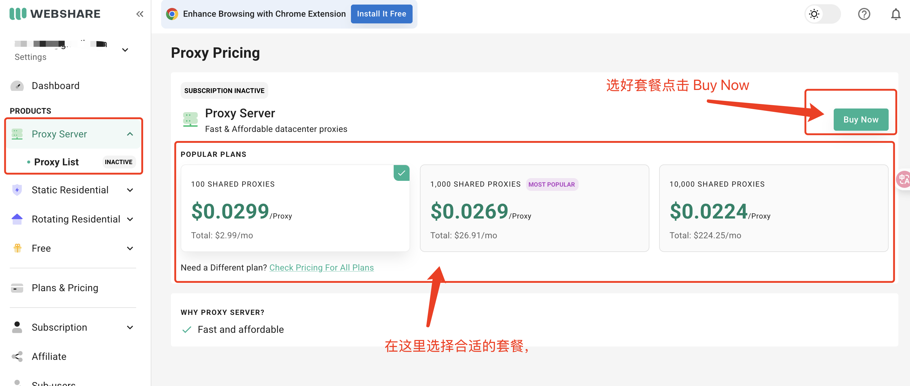

    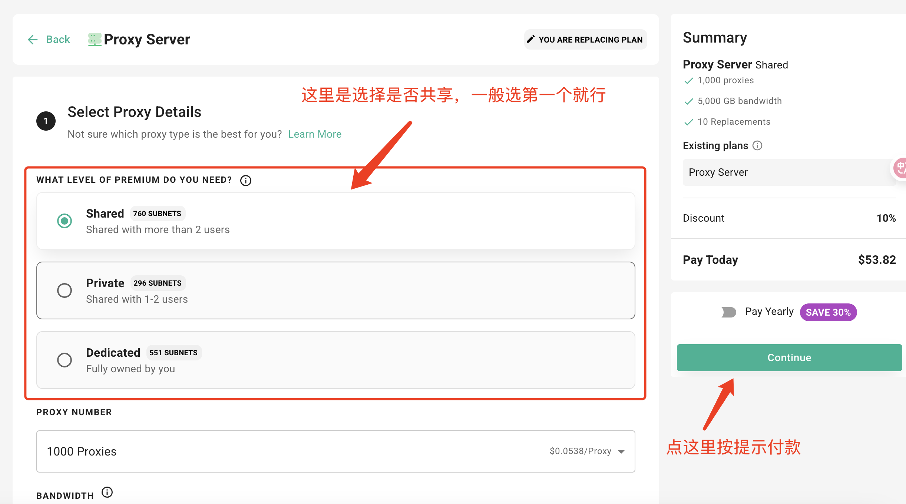

    *Webshare 代理套餐选择页面*
3.  **获取代理列表**：
    - 购买成功后，通常在“My Proxies”或“Proxy List”页面可以找到您的代理列表。
    - 导出或复制代理信息，格式通常为 `IP:端口:用户名:密码` 或 `IP:端口:用户名:密码:协议类型`。
    - 请确保选择支持 HTTP/SOCKS5 协议的代理。
    
    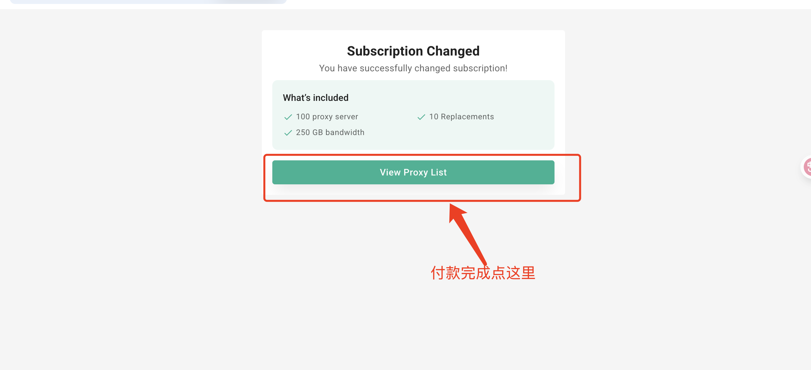

    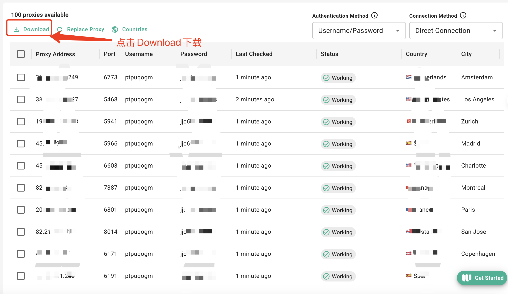

    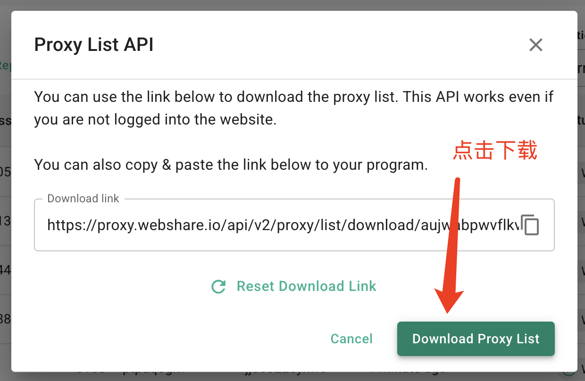

    *Webshare 代理列表页面*

#### 海外代理 购买教程 (动态IP)

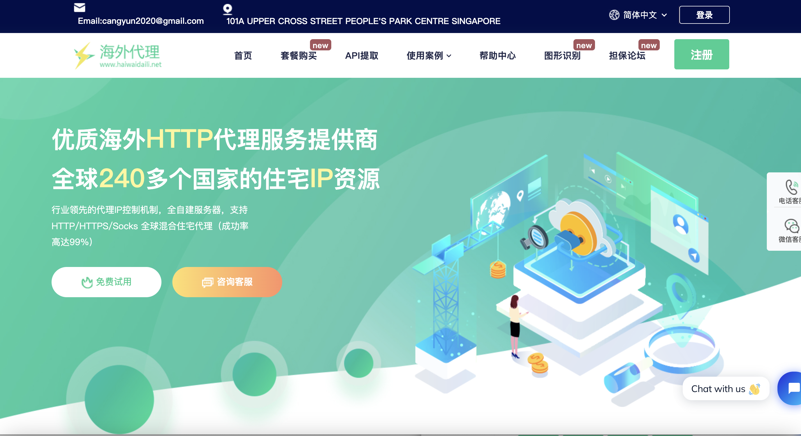

*海外代理官方网站首页*

1.  **访问官网并注册**：
    - 打开海外代理官方网站：[https://www.haiwaidaili.net](https://www.haiwaidaili.net/register?Invitation_code=12333)
    - 注册并登录您的账号。
    
    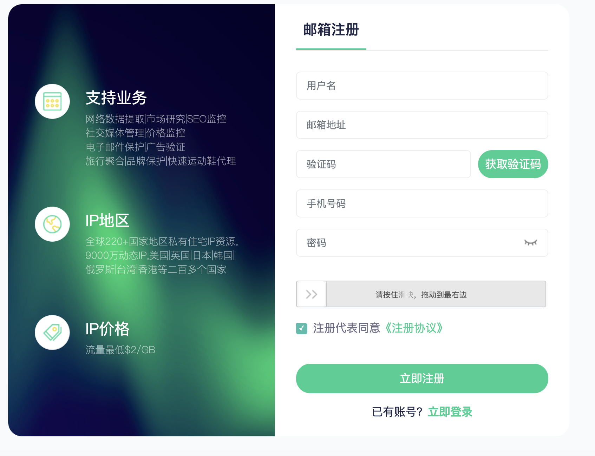

    *海外代理注册页面*
2.  **选择动态IP套餐并购买**：
    - 点击左侧的定价，选择价格合适的套餐，点击立即购买按提示付款。（初次建议购买测试套餐，后续再根据用量进行购买）
    
    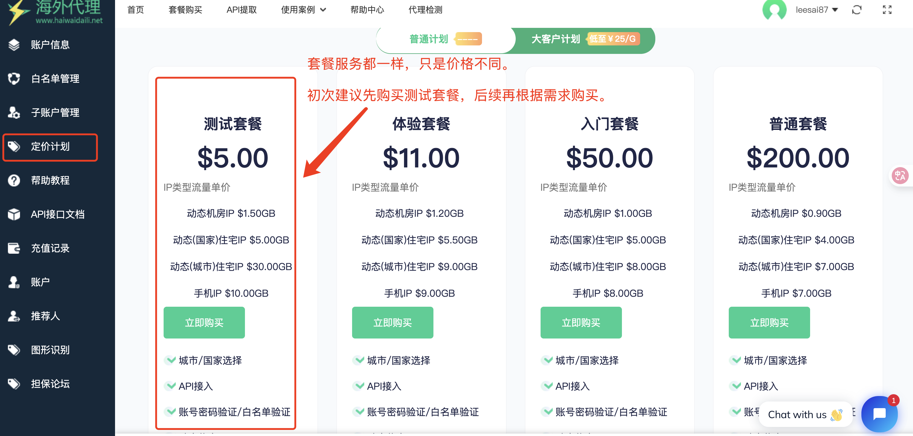

    *海外代理套餐选择页面*
3.  **配置和获取代理**：
    - 初次使用请先在个人中心 - 子帐户管理 页面创建一个子帐户：[子帐户管理-链接](https://www.haiwaidaili.net/auth_user.html)
    
        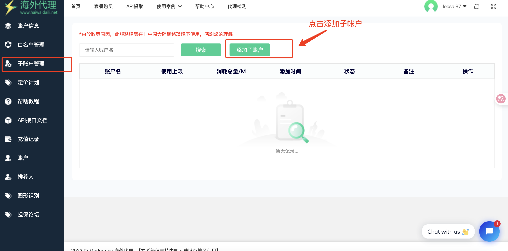
        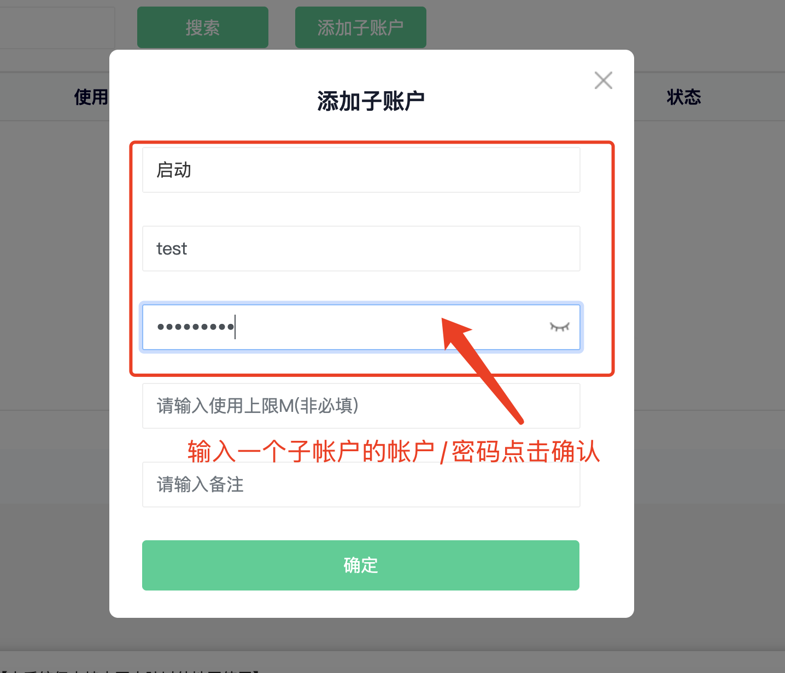
        *子帐户管理页面*

    - 随后到 API提取 - 帐户认证获取 - 帐户认证获取页面。
    - 选择 对应的子账号 然后按下图 配置选择好 接入点、IP类型、代理协议、国家地区、SESSION、生成格式， 输入自己需要的代理数量。
    - 设置完毕后，先点击生成案例，再点击下载代理。
    - **❕❕❕注意：生成格式必须设置为 hostname:port:username:password**

    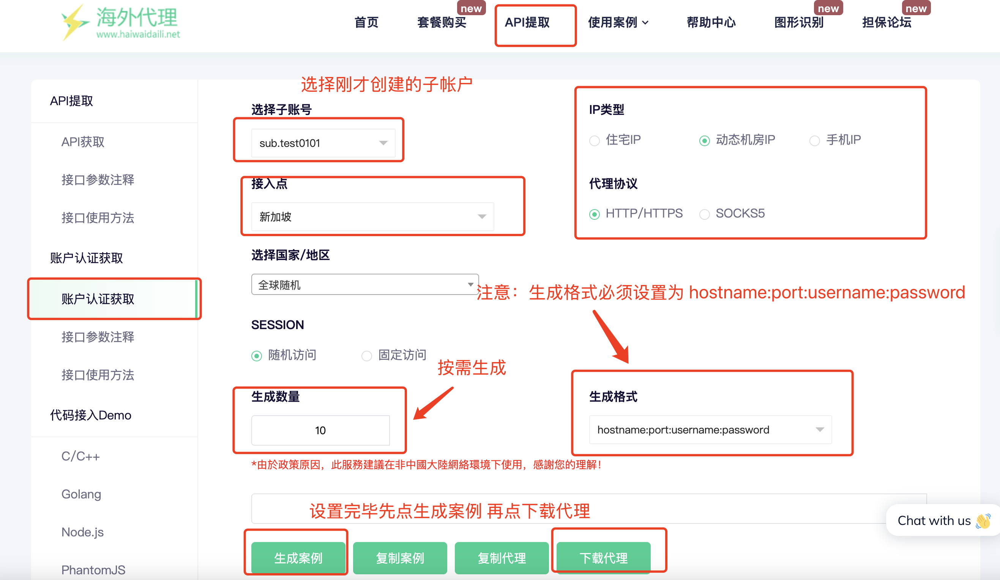

    *海外代理配置获取页面*

---

## 4. 如何导入代理

1. 打开“代理管理”页面，点击“导入代理”按钮。
2. 在弹出的输入框中，每行输入一个代理，格式如上所述。
3. 支持批量粘贴，每行一个代理。
4. 点击“确定”完成导入，系统会自动校验格式并提示成功或失败。

    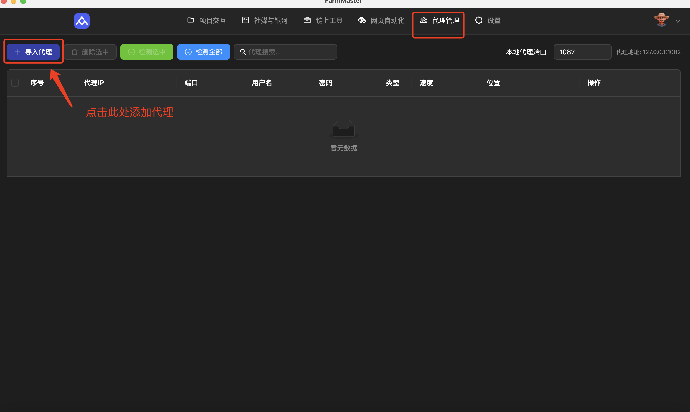

    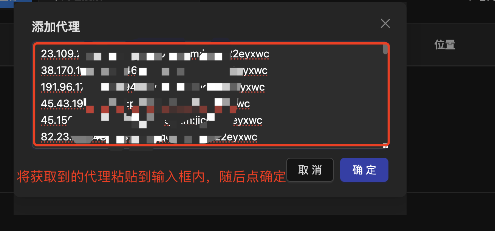

    *代理管理页面*

5. **测试代理连接**：
   在代理管理页面，选择代理后点击"测试连接"按钮。正常情况下会显示代理的IP地址和响应时间。如果测试失败，请按照常见问题的Q2的方法逐步排查。

    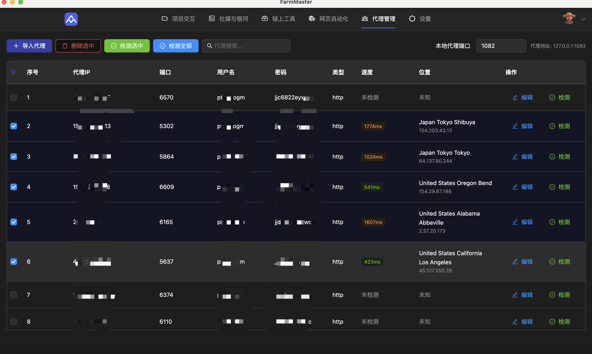

    *代理连接测试功能*

**注意事项：**
- 代理格式必须正确，否则无法导入。
- 已存在的代理不会重复导入。
- 支持批量删除、批量导入、编辑代理信息。

---

## 5. 常见问题

**Q1：导入时报“代理格式不正确”怎么办？**  
A：请检查代理格式是否为 `IP:端口:用户名:密码` 或 `IP:端口:用户名:密码:协议类型`，IP和端口必须为数字，协议类型仅支持 http/socks/socks5。

**Q2：我的代理连接不上是什么原因？检测一直提示失败是怎么回事？**  
A：代理测试失败，通常是下面几种情况，建议逐个测试：
1. 检查导入的IP格式是否正确。我们支持的格式是 `IP:端口:用户名:密码` (例如: `127.0.0.1:1080:admin:password` 或 `localhost:1080:admin:password`) 或 `IP:端口:用户名:密码:协议类型(http/socks5)` (例如: `127.0.0.1:1080:admin:password:http`)。正常情况下导入代理后都能在对应的列中看到数据，如果看不到可能是格式错误。
2. 代理IP仅支持国内访问：请先关闭梯子（VPN/代理软件），然后重新检测。
3. 代理IP仅支持境外访问：请打开梯子（VPN/代理软件）的代理模式重新检测。如果仍然不行，尝试打开增强模式（通常只有 `ClashX Pro` 等软件有此模式）后再次尝试。
4. 以上方法都没有用的话，建议更换代理重试。

**Q3：如何批量删除代理？**  
A：在代理列表中勾选需要删除的代理，点击“删除选中”即可。

**Q4：支持哪些协议？**  
A：目前支持 `http`、`socks5` 两种协议，建议根据实际需求选择。

**Q5：代理信息会保存在哪里？**  
A：代理信息会保存在本地（`localStorage`），重启软件后依然可用。

**Q6：MAC 使用小火箭（Shadowrocket）无法连接代理是怎么回事？**  
A：关闭小火箭的代理连接后再进行尝试，如果仍然失败请按照Q2进行排查。

**Q7：如何测试代理是否正常工作？**  
A：在代理管理页面，选择代理后点击"测试连接"按钮。正常情况下会显示代理的IP地址和响应时间。如果测试失败，请按照Q2的方法逐步排查。

*代理连接测试功能*

**Q8：运行脚本时报错429是什么问题？**  
A：一般是IP被ban了，出现这种问题建议再重新跑一次，如果多次不行大概率是代理IP不行。

---

如有其他问题，请联系技术支持或查阅相关帮助文档。 