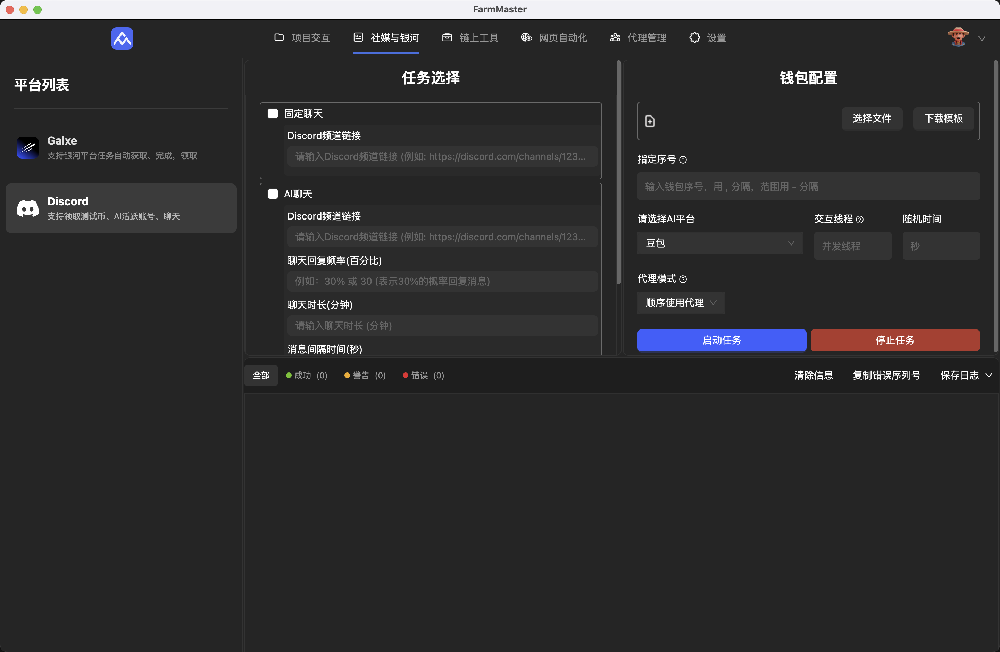
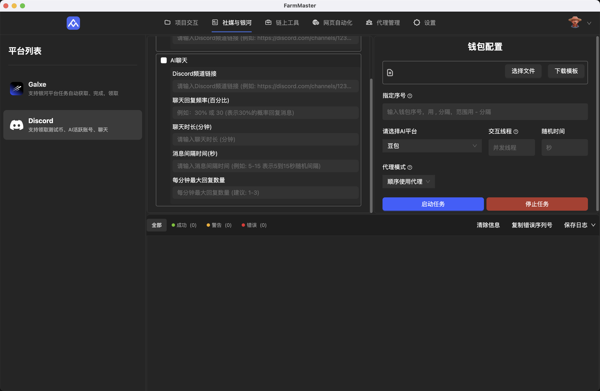

# Discord交互

[← 返回使用教程](../README.md) | [← 返回主页](../../README.md)

Discord 交互模块支持自动发送指定消息到服务器频道，以及 AI 聊天养号、做任务等功能

## 功能

- **自动发送消息:** 在指定的服务器频道中自动发送预设的消息，常用来领取测试币
- **AI 聊天:** 利用 AI 模型进行智能聊天，可用于社区互动、获取Role、等级等任务

## 配置

要使用 Discord 交互功能，您需要先 Discord 交互文档

### 文档配置

- **index:** token序号，填写数字，用来进行后续定位有问题的 token，必须填写
- **discordToken:** 账号的token，必须填写
- **proxyId:** 指定使用 `代理管理` 里面代理的序号，如不懂可以直接使用 proxy 或者询问客服
- **proxy:** 指定代理，格式为：`IP:端口:用户名:密码:类型` 如不填类型，则默认使用 http 代理
- **message:** 指定发送的聊天消息，AI聊天任务不需要填写

### 任务配置

- **指定序号:** 指定交互的token账户
- **选择AI平台:** 用户如果要执行AI聊天任务，则必须指定使用 AI 进行对话，建议使用豆包
- **交互线程:** 并发的线程数量，不建议进行高并发，防止AI互相聊天导致刷屏被频道管理人员踢出服务器
- **代理模式:** 支持`顺序使用代理`、`使用文档指定代理`、`不使用代理`三种模式，建议在文档指定代理，防止 IP 混乱导致封号

### 如何手动获取 Discord Token

1. 登录您的 Discord 账号。
2. 打开开发者工具 (通常是按 `Ctrl+Shift+I` 或 `Cmd+Opt+I`)。
3. 切换到 `Network` (网络) 标签页。
4. 随便在一个服务器中进行发言，找到 `massage` 的请求
5. 在 `Headers` (标头) 标签页中，找到 `Request Headers` (请求标头) 部分。
6. 找到 `authorization` 字段，它的值就是您的 Discord Token。

## 使用

配置完成后，您就可以在软件中使用 Discord 交互功能了。

### 发送固定消息

在软件的界面中，找到发送消息的功能模块。

1. 输入服务器频道的完整url，直接从浏览器复制
2. 输入任务配置，点击开启任务即可

### AI 聊天

启用 AI 聊天功能后，软件会自动在指定的频道中进行聊天。

1. 输入服务器频道的完整url，直接从浏览器复制
2. 输入回复消息的频率，人少的频道频率可以高一点，人多的频道频率低一点，防止高频发言被管理员检测
3. 输入聊天时长，这个是指定AI在这个频道聊天的时长，时间到就进行下一个账户进行聊天
4. 消息回复间隔是2条消息回复的间隔
5. 每分钟最大回复量指每分钟内最多回复几条消息，建议1条就行