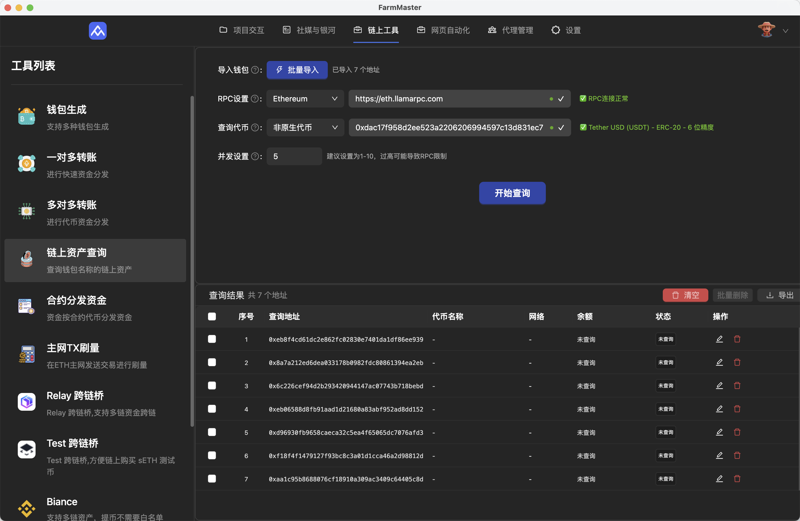
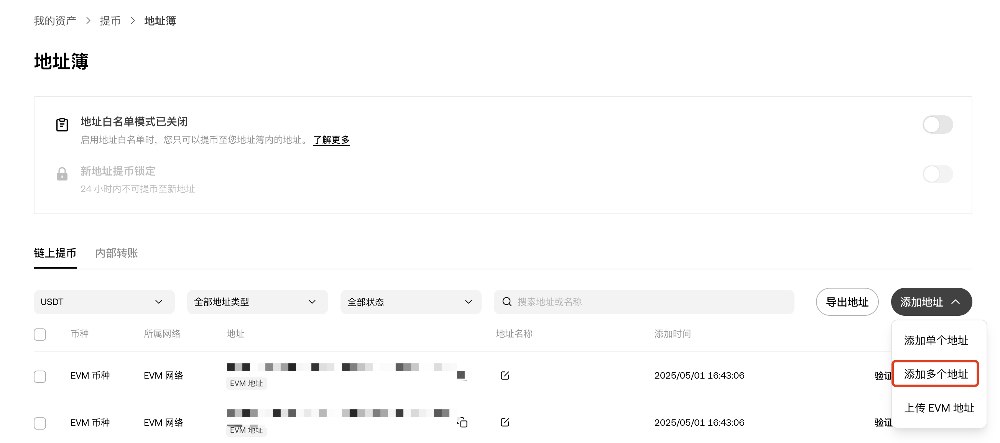

# 链上工具

[← 返回使用教程](../README.md) | [← 返回主页](../../README.md)

链上工具模块提供各种区块链相关的自动化工具功能。

## 📋 支持的工具

### 🔧 区块链工具
- [钱包生成] - 批量生成多个链的区块链钱包
- [一对多转账] - 一个主钱包批量向多个钱包直接进行转账，适合不需要防女巫的快速分发资金
- [多对多转账] - 多个钱包向不同&相同地址直接进行转账，具备多种转账模式，适合钱包资金快速分发、归集
- [链上资产查询] - 支持 EVM 链的代币、Nft等资产的批量查询
- [合约分发资金] - 通过合约快速分发资金，适合测试网资金分发，具备一定的隐蔽性及防女巫
- [主网Tx刷量] - 支持交互多个主网协议，实现快速完成钱包活跃
- [Relay跨链桥] - 移植 Relay Dapp，实现批量跨链的功能，方便在各个链快速补充资金
- [Test跨链桥] - 支持 Arb 、Op链购买 Sepolia ETH 测试币

### 💰 交易所提币
- [币安提币] - 币安交易所自动提币
- [OK提币] - OKX交易所自动提币
- [Bitget交易所] - Bitget交易所自动提币

## 🎯 使用教程

### 钱包生成

1. 支持使用自己的助记词，适合从助记词恢复钱包
2. 一次性可以选择多个链进行生成
3. 生成数量可以自定义

4. 生成钱包后，需要点击 保存Excel 才能将生成的钱包文档保存到本地

### 一对多转账

1. 输入转账的钱包私钥和导入接收的钱包地址，表格卡片中会自动显示
2. 在网络选择中，已经自定义了大部分 evm 网络的RPC，另外还可以自定义 RPC 链接
3. 转账代币支持原生代币，也就是链的Gas币，以及非原生代币，也就是 Erc20 代币，选择非原生代币则需要输入代币合约地址，输入后会自动查询代币名称供二次检查

4. 转账金额支持固定金额和随机金额，固定金额只全部转账相同的金额，随机金额指自动生成x-y区间设置精度的金额，比如0.1-1，精度4.就可能随机生成0.6666的数量
5. 执行设置的随机时间为每一笔转账后的暂停时间，并发数量则为一次进行几笔转账，建议使用默认值即可

### 多对多转账

1. 多对多转账设置与一对多类似，不过转账金额增加了 清空钱包，意思就是将发送转账的钱包内的资金全部转账给接收地址，可进行快速资金归集

### 链上资产查询

1. 链上资产查询支持原生代币、ERC20代币、NFT（1155、721）查询

### 合约分发资金

1. 导入发送资金的钱包私钥和接收钱包地址后，会根据你选择的链查询当前发送钱包的资金余额
2. 转账数量支持固定数量和随机数量，设置与其他转账一样
3. 设定数量后会自动计算当前发送钱包的资金是否满足，如果不满足，则开启按钮无法点击，可自行调整发送金额或者补充发送钱包的资金
4. 每批钱包数量可自定义，最大建议不要超过200

### 主网Tx刷量

1. 导入模板文件后，表单里面会自动查询导入钱包地址的当前交易次数
2. 交易行为可以设置选择多个协议，每次交互的协议为从已选择的协议中随机挑选
3. Gas限制可以设置最高Gas限制，比如设置为1，当主网Gas超过1，则会暂停15分钟，等待15分钟后再次查询，如果低于1才会进行刷量交互，防止短期Gas波动带来的费用损失
4. 目标次数是为给钱包设定目标的交易次数，如果设置为5，则将钱包的总交易次数刷到5就停止后续的交互，而非交互5次，每个钱包还可以单独设置目标次数

### Relay跨链桥

1. Relay网页上支持的EVM已经完全迁移到客户端中，目前发送链和目标链均为自动获取

2. 转账代币以及接收代币目前也均为自动获取，选择你需要跨链的代币和对象链接收的代币即可

### Test跨链桥

1. 支持Arb、Op链购买，用的是LayerZero协议，建议购买前先自己去 [官网](https://testnetbridge.com/sepolia) 查询汇率
2. 跨链完成后，会自动查询Seth到账金额

### 交易所提币
- 支持主流交易所API接入
- 自动化提币和充值
- 批量操作支持

## 📋 准备清单

使用链上工具功能需要以下准备：

| 项目 | 需要准备 |
|-----|----------|
| 交易所账号 | 相关交易所的API密钥 |

## 🚀 操作流程

### 1. API配置
1. 获取交易所API密钥
2. 配置API权限设置
3. 币安交易所需要绑定IP，Okx则不需要
4. 各家交易所密钥创建入口不同，具体请自行寻找
5. 由于OKX近期加强了风控策略，为防止账户被风控，建议使用币安进行提币操作

### 2. 提币配置
1. 导入接收的钱包地址
2. Okx及Bitget需要添加提币白名单，Okx在 资产管理--提币--选择提币币种--管理地址薄--批量添加地址，Bitget在 提现--选择提币币种--提现地址薄管理--添加提币地址

3. 创建API和添加好地址白名单后，就可以在软件页面输入KEY、密钥，输入完成后点击 `获取余额`，系统会自动获取当前交易所账户内的资金余额，用户自行选择提币币种和提币网络即可

## ❓ 常见问题

### Q：API连接失败怎么办？
**A：** 检查API密钥和权限设置，确保网络连接稳定。

### Q：交易失败或被拒绝？
**A：** 检查余额是否充足，手续费设置是否合理。

### Q：提币到账时间过长？
**A：** 检查网络拥堵情况，联系交易所客服确认状态。

## 🔧 技术支持

如果您遇到任何问题，请在微信群联系技术支持人员。