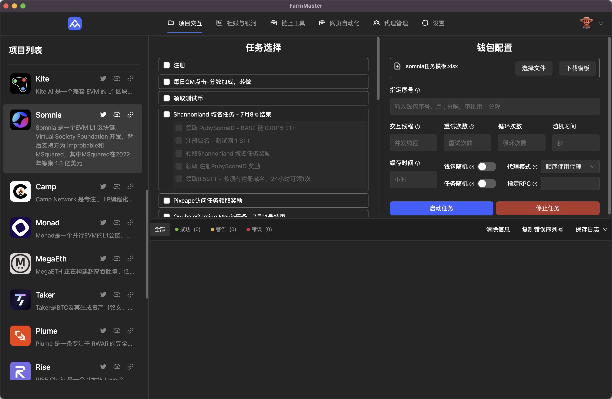

# 项目交互

[← 返回使用教程](../README.md) | [← 返回主页](../../README.md)

项目交互模块支持多种区块链项目的自动化交互功能。

## 🚀 快速开始

## 📱 界面布局详解

### 左侧项目选择栏
**作用**：选择要执行交互的 Web3 项目

**功能说明**：
- 每个项目都包含了简单的项目背景，及直达的链接
- 点击项目可查看项目详情和可用的交互任务

### 中间任务选择区域
**作用**：配置和选择要执行的具体交互任务

**功能说明**：
- **任务列表**：显示当前项目所有可用的交互任务
- **任务选择**：通过复选框选择要执行的任务
- **批量操作**：支持同时选择多个任务批量执行

### 钱包配置区域
**作用**：管理和配置钱包信息，设置交互参数

**功能说明**：
- **钱包文件导入**：支持下载和导入钱包配置文件，每个项目的模板文件不一致但基础需求一致，比如所有evm项目都需要钱包地址和私钥，如该项目需求的参数不特殊，1份模板文档可供多个项目使用，如项目A需要（钱包地址、私钥、推特token、dc token），项目B也需要这些配置参数，则可以使用同一份文档。
- **指定序号**：设置钱包使用的序号范围，支持逗号分隔、分级范围等格式，该选项主要是方便执行失败的钱包地址和指定钱包地址的运行，非必要无须填写

**配置参数**：
- **交互线程**：设置同时执行的并发线程数，单项目建议10-20，视钱包总数决定，默认为1线程
- **重试次数**：设置失败后的重试次数，默认为3次，除特别要求之外，可不填
- **循环次数**：设置任务循环执行的次数，设置1就是当前所有钱包地址或者指定地址执行1轮脚本交互，设置2则执行2轮...如需使用，请搭配缓存时间设置
- **随机时间**：设置钱包间隔的随机时间（秒），可设置x-y的格式或者固定时间
- **缓存时间**：设置执行状态缓存的时间（小时），如钱包A在00:00执行成完成任务1，设置6则表示在未来6小时内不会重复执行该任务，默认为不设置缓存
- **钱包随机**：开启钱包随机选择功能，打乱导入的钱包数据，执行交互时随机选择钱包进行交互，建议日常使用开启
- **代理模式**：设置代理使用模式，默认为按照导入的代理 IP 顺序使用，也可以选择随机使用与不使用，请根据实际场景选择
- **任务随机**：开启任务随机执行功能，如一次性选择了任务1、2、3、4、5，开启后每个钱包交互的任务顺序不一致，按需开启
- **指定RPC**：指定使用的RPC节点，默认不需要填写，除非有特殊需要

- **启动任务**：开始执行选中的交互任务（蓝色按钮）
- **停止任务**：停止当前正在执行的任务（红色按钮）。请注意，如果为链上交互，就算如果在发送交易步骤点击停止，极大概率该笔交易也会上链

### 底部日志区域
**作用**：控制任务执行和查看运行状态

**功能说明**：

- **状态显示**：实时显示任务执行状态
  - 🟢 成功 - 成功完成的任务数量
  - 🟡 警告 - 有警告的任务数量  
  - 🔴 错误 - 执行失败的任务数量
- **操作按钮**：
  - 清除信息 - 清除当前项目所显示的全部日志信息
  - 复制错误序列号 - 复制交互失败的钱包序列号
  - 保存日志 - 保存执行日志到文件

**功能说明**：
- **实时日志**：显示任务执行过程中的详细日志信息
- **状态反馈**：显示每个操作的成功/失败状态
- **错误信息**：显示详细的错误信息和调试信息
- **进度跟踪**：跟踪任务执行进度和完成情况
- **滚动显示**：自动滚动显示最新的日志信息

## 🎯 使用流程

1. **选择项目**：在左侧项目列表中选择要交互的项目
2. **配置钱包**：在右上角导入钱包配置文件，设置相关参数
3. **选择任务**：在中间区域选择要执行的具体任务
4. **调整参数**：根据需要调整线程数、重试次数等参数
5. **启动任务**：点击"启动任务"按钮开始执行
6. **监控日志**：在底部日志区域查看执行进度和结果
7. **处理异常**：如有错误，根据日志信息进行排查和处理

## 📝 通用配置

所有项目交互都需要以下基础配置：

- ✅ 钱包配置
- ✅ 代理IP配置
- ✅ 基础网络设置

具体配置方法请参考 [程序安装配置教程](../../installation/README.md)。

## 🔧 技术支持

项目交互相关问题请联系：@1号技师全心全意为您服务